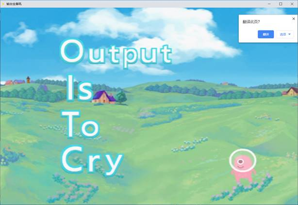
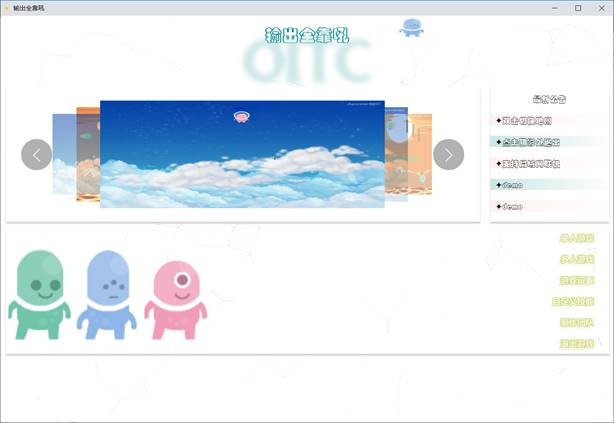
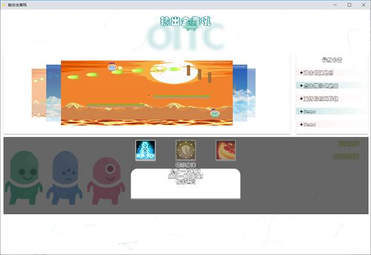
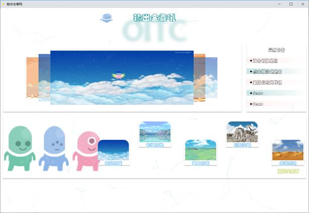
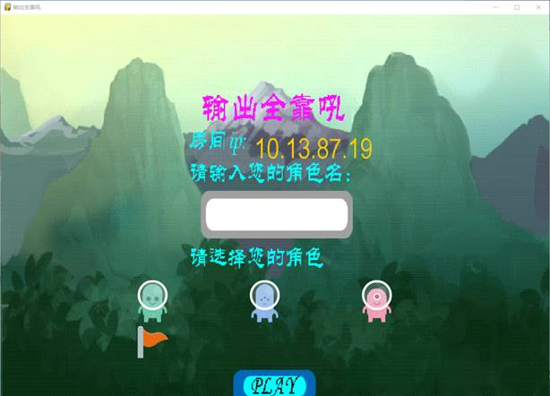
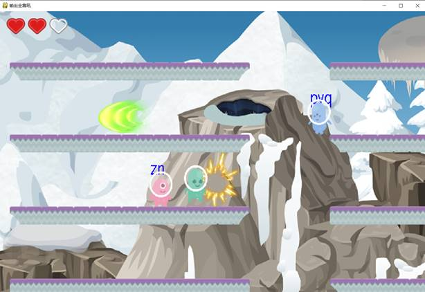

# 游戏：OITC

Output Is To Cry是一款用声音控制的游戏，这个游戏是和另外两位同学共同开发，个人在其中主要负责游戏中角色的技能、动作的开发，以及实现游戏在局域网同步。

- 游戏开始界面

- 技能选择与录制声音

- 地图选择

- 人物选择

- 游戏画面

## 游戏玩法介绍

本游戏中玩家可通过AWSD控制人物的移动，但是玩家要发动攻击只能通过声音来控制，每当系统检测到玩家说话便可发动一颗子弹，子弹的威力和大小与玩家声音成正比，因此要想将敌人击落至地板外就必须大声吼出来，这样才有机会将对方击败。

同时玩家可以在游戏开始界面选择一个技能并为之录音，比如选择“隐身”技能，并录制了一段语音，之后在游戏中玩家只要再次对着电脑喊出之前录制的语音即可发动技能。比如之前录制的语音是”隐身“，那么在游戏中喊出”隐身“两个字便可隐身。

游戏联网、声音识别等实现细节请看实验报告pdf。

## 游戏启动步骤

运行Python_Main.py文件即可。（如果提示缺少python库请按照提示安装相应的python库即可）

如果遇到运行困难可以通过 hhhhhzs@qq.com 邮箱联系我。