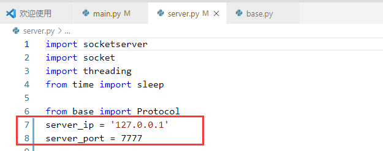
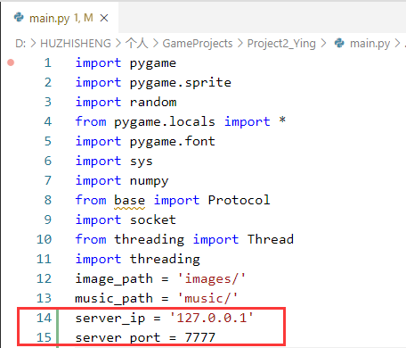
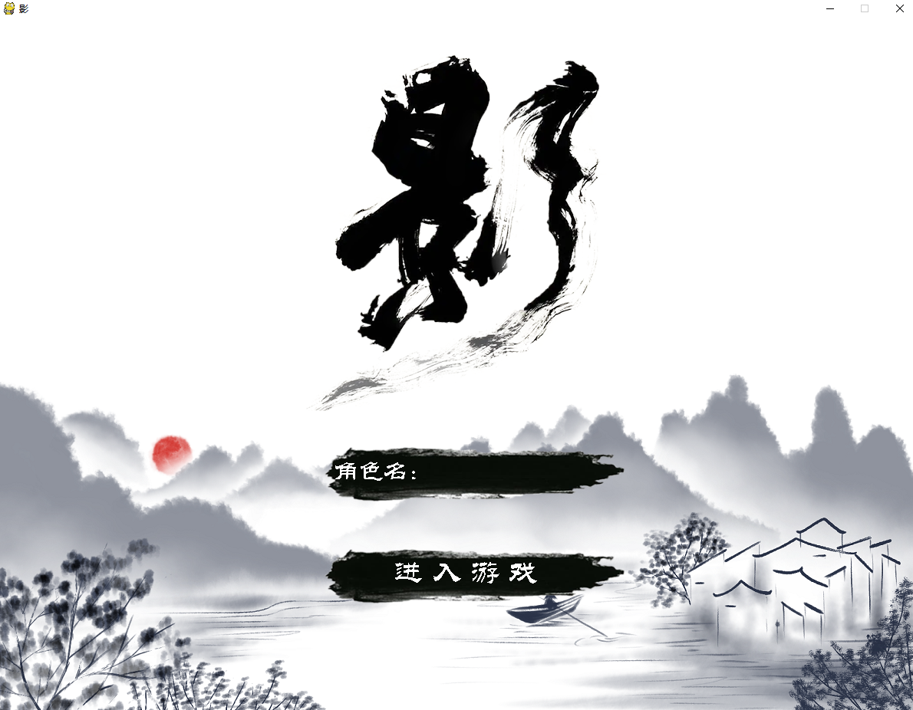
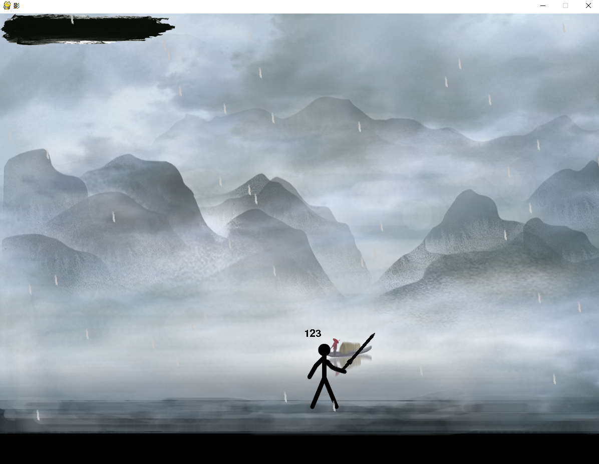
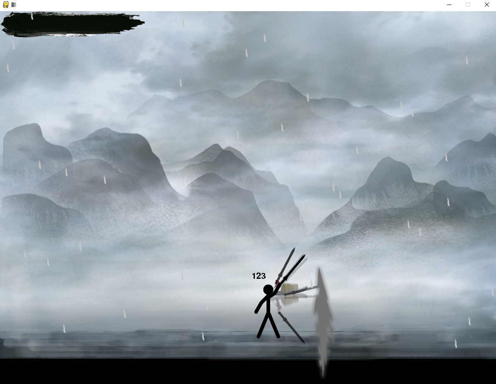
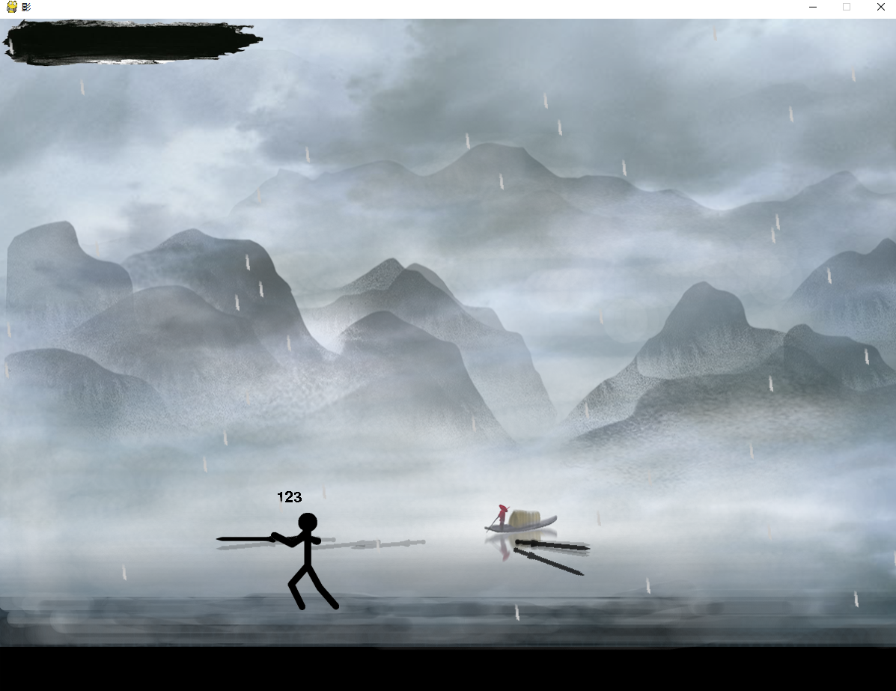
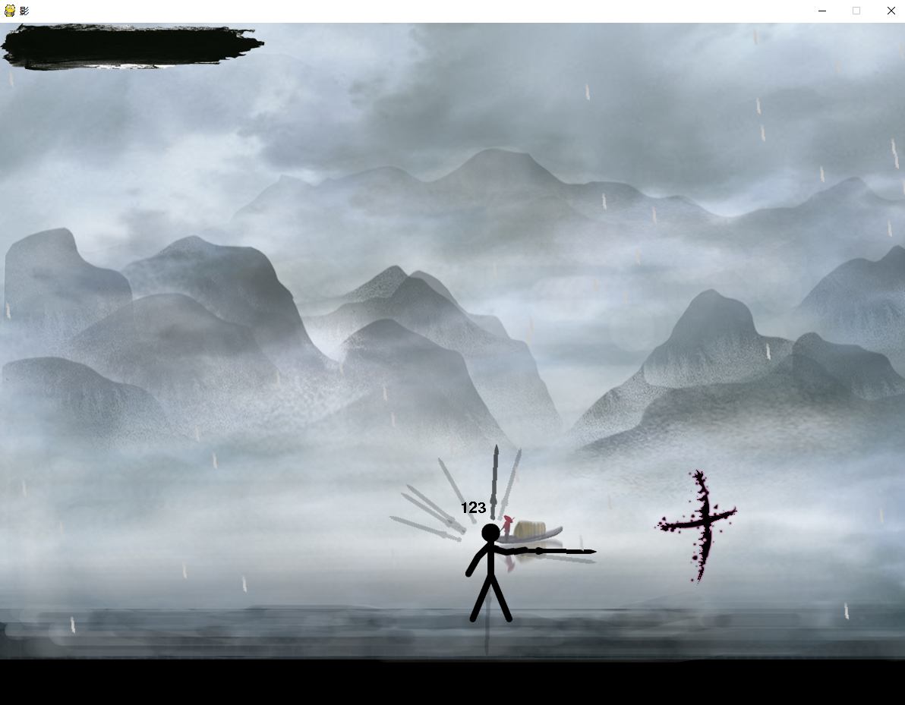
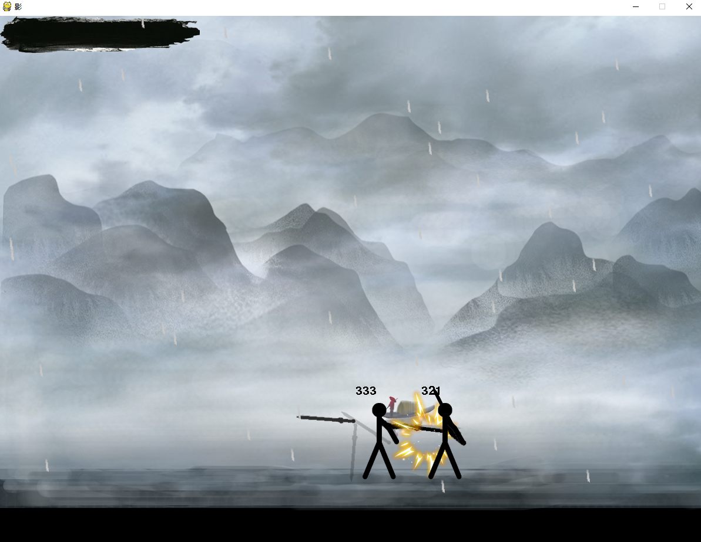

# 游戏：影

本游戏是一款联机横板动作小游戏，基于Pygame，个人独立开发。

游戏整体风格是水墨武侠风，特点是玩家除了移动要用键盘外，其余操作均是用鼠标挥动人物手中的剑来实现，同时挥动不同的动作还可发动对应的技能，将剑靠近角色还可摆出防御姿势。

游戏场景是江边的雷雨天，玩家可在游戏中聆听雨声、雷声，颇具武侠体验和朋友在狂风暴雨中的比武切磋。


## 游戏运行步骤

1. 在server.py中修改服务器将要部署到的网络ip地址server_ip和端口号server_port

   （默认是127.0.0.1本机地址）



2. 再在main.py中修改目标服务器的ip地址和端口号，一定要和服务器部署到的ip和端口相同



3. 然后就可以体验游戏

```python
#切换当前路径到本项目

#启动服务器
python server.py
#然后启动游戏即可
python main.py
```


## 游戏玩法介绍

玩家通过WASD来控制角色的移动，连按两下A或D则可以奔跑。

按W是跳跃，可以在空中再额外跳跃一次（二段跳）



游戏的攻击操作主要靠挥动鼠标来控制角色挥舞剑来攻击对方。



快速地向上/下挥动鼠标，可发动技能1，该技能可以将敌人击飞至空中。



快速地向左或向右挥动鼠标，可发动技能2



先快速地竖向挥动鼠标，再横向挥动鼠标，可发动技能3



如果控制鼠标让小人把剑竖着靠近自己，则可以防御对方的攻击



画面左上角是玩家当前的血量值，当血条为空时，可点击"我不服按钮"即可复活继续


